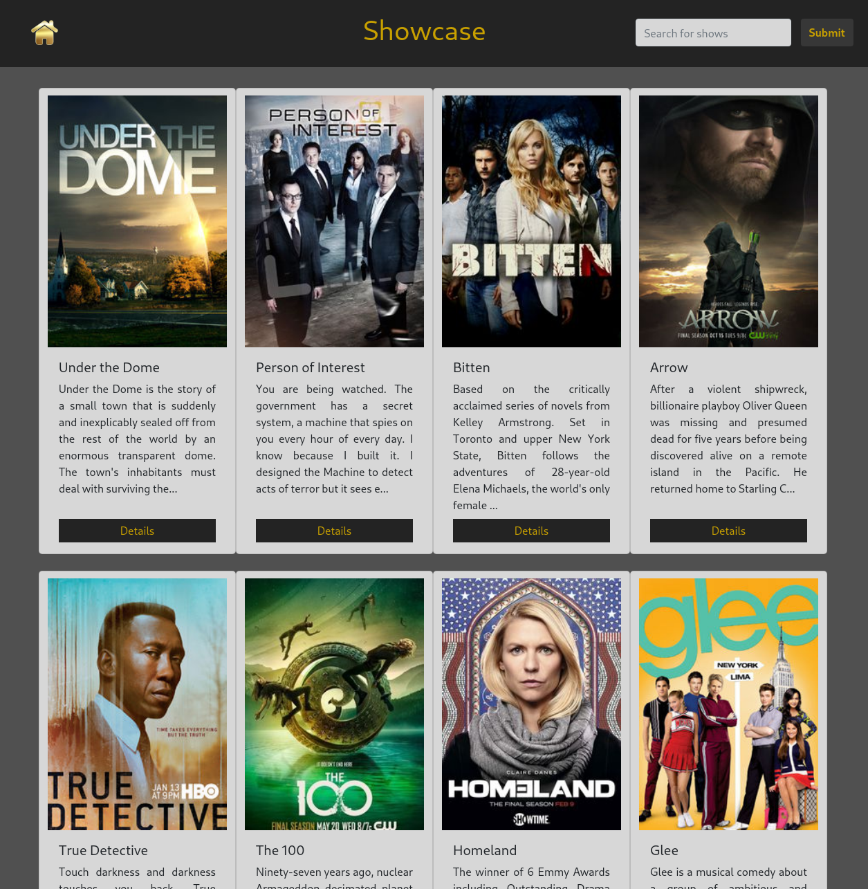

# Showcase

## Description

Showcase allows users to browse TV shows from all over the globe and access information about shows including episodes, cast and crew, air dates and times, networks, and more.  It is built on the TVMaze API and in addition to direct information about shows, contains links to official sites and profiles for cast and crew. Check out the <a href='https://showcase-tv-database.netlify.app/'>live site</a> on Netlify!

## Technologies

This app was built with or took advantage of the following technologies
- React | React Router | React Bootstrap
- JavaScript | JSX | CSS | JSON
- GitHub | Git
- TVMAZE API
- Netlify

## Getting Started
- Fork and Clone
- In the repository install modules and dependencies with the 'npm install' command
- Once installation is complete, use the 'npm start' command to run the app locally

## Contribution Guidelines

Although I consider the app to be in a ready state for open use, I welcome any feedback on bugs or UI pain points that you discover, as well as any suggestions for improvements. Please reach out to me on <a href='https://www.linkedin.com/in/andrew-retherford/'>LinkedIn</a> with any of the above. Praises and accolades are also welcome =)
